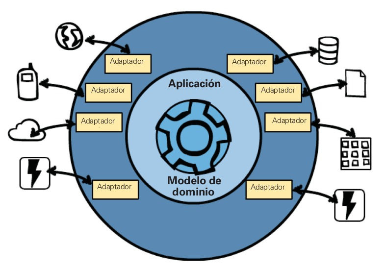
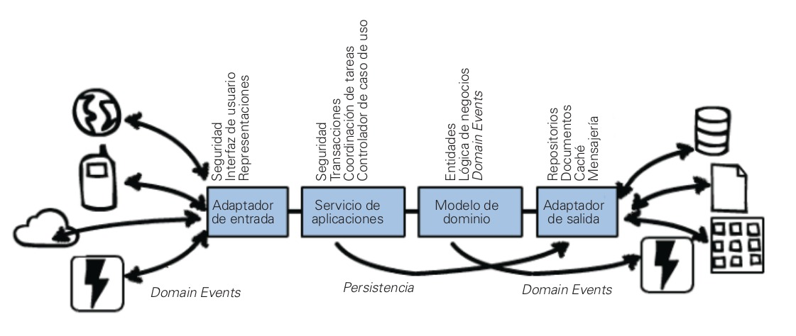

# DDD

> DDD es un conjunto de herramientas para crear modelos de software avanzados.

Implementar un software que no solo modele correctamente las necesidades de su organización, sino que también rinda a gran escala utilizando las arquitecturas de software más avanzada.

DDD es un conjunto de herramientas que ayudan a diseñar e implementar software que proporciona un gran valor, tanto de forma estratégica como táctica.

### Diseños buenos, malos y efectivos

Muchos equipos de desarrollo de software no dedican tiempo a esta tarea. En su lugar, practican lo que se conoce como “organizar las tareas”. El costo para el negocio que paga por estos
diseños inexistentes por lo general es muy alto.

###### Dificultades:

- El desarrollo de software se considera un centro de costos.
- Los desarrolladores están obsesionados con la tecnología, en lugar de dedicarse a pensar y diseñar primero.
- La base de datos es prioridad absoluta. **La gran mayoría de discusiones para resolver problemas técnicos se concentran en la base**.
de datos y en su diseño, en lugar de trabajar en los procesos y
operaciones del negocio.
- Los desarrolladores no hacen suficiente énfasis en usar una nomenclatura para objetos y componentes acordes con la función del negocio. Esto produce un gran abismo entre el modelo mental de la empresa y el software que proporcionan los desarrolladores.
- Los interesados de la organización producen aisladamente especificaciones utilizadas apenas parcialmente por parte de los desarrolladores.
- El negocio demanda muchas estimaciones y con el máximo de precisión posible. Calcularlas consume mucho tiempo y esfuerzo
- Los desarrolladores ven la lógica del negocio en los componentes de la interfaz de usuario y en mecanismos de persistencia. Además, con frecuencia **ejecutan operaciones de persistencia en medio de la lógica del negocio**.
- Se han creado **abstracciones innecesarias**, generalizar exageradamente las soluciones en lugar de abordar las necesidades concretas del negocio.
- Servicios muy acoplados entre sí, donde una operación que se ejecuta dentro de un servicio acaba comprometiendo directamente a otro servicio.

### Diseño estratégico
No es posible aplicar efectivamente el diseño táctico a menos que se empiece con el diseño estratégico.
Se podrá ver cómo desarrollar un Ubiquitous Language como modelo del dominio dentro de un Bounded Context explícitamente definido.

### Diseño táctico

## Diseño estratégico con Bounded Contexts y Ubiquitous Language
Modelar de forma explícita un Ubiquitous Language dentro de un Bounded Context.

**Bounded Context** es un límite contextual semántico. Dentro de un espacio delimitado, cada componente del modelo de software tiene un significado específico que desarrolla cosas específicas.

(Bounded Context es el lugar donde se implementa un modelo)

Cuando se desarrolla un Bounded Context como iniciativa estratégica clave de una organización, se conoce como Core Domain.

El lenguaje se conoce como Ubiquitous Language porque se habla entre todos los miembros del equipo y se implementa en el modelo de software.

**Separar claramente el código fuente y el esquema de la base de datos para cada Bounded Context de la misma manera que separa el lenguaje ubicuo.**

> Es posible que para un mismo término, las personas de diferentes equipos tengan una definición diferente,y esto se debe a que su conocimiento del negocio está relacionado con uncontexto distinto, ya que ellos trabajan en un Bounded Context diferente.

##### Diferencias en las pólizas por función
Póliza en suscripción, póliza en inspecciones y póliza en reclamaciones.
Si se intenta unificar los tres tipos de pólizas en una sola para dar respuesta a las necesidades de las tres áreas del negocio, seguramente habrá problemas.

¿Hay tres significados para la póliza? Luego, existen tres Bounded Contexts, cada uno con su propia póliza.

## Arquitectura

Adaptadores de entrada, como los controladores de la interfaz de usuario, controladores API tipo REST.
Servicios de aplicación que organizan casos de uso y gestionan transacciones.
Modelo de dominio.
Adaptadores de salida, tales como la gestión de persistencia y los productores de mensajes.

(Detalle de capas de arquitectura el capítulo 4 de Implementing Domain-Driven Design.)

## Diseño estratégico con subdominios

#### Tipos de subdominios
- Core Domain
- Subdominio de soporte
- Subdominio genérico

## Diseño estratégico con Context Mapping

El dominio principal tiene que integrarse con otros Bounded Contexts. Esta integración se conoce en DDD como Context Mapping.

###### Alianza
Cada equipo es responsable de un Bounded Context, y éstos crean una coalición para alinear los dos equipos a un conjunto de objetivos dependientes

###### Kernel compartido
Representado por la intersección de dos Bounded Contexts, describe la relación entre dos o más equipos que comparten un modelo pequeño aunque común.

###### Relación cliente-proveedor
El proveedor está en la ups tream (zona alta) de la dependencia, y el cliente está en la downstream.

###### Relación conformista
Cuando hay equipos upstream y downstream, y el equipo upstream no tiene ninguna motivación para apoyar las necesidades específicas del equipo downstream.

#### Capa anticorrupción
Es la relación más defensiva en el Context Mapping: el equipo downstream crea una capa de traducción entre su Ubiquitous Language (modelo) y el Ubiquitous
Language (modelo) que está upstream.

#### Servicio abierto
Un servicio abierto (Open Host Service) define un protocolo o interfaz que da acceso al Bounded Context mediante un conjunto de servicios.

#### Idioma publicado
Es un lenguaje de intercambio de información que posibilita consumo sencillo y traducción de varios Bounded Contexts.

## Diseño táctico con agregados

##### Entity
Una entidad modela una cosa individual y cada una tiene una identidad única que puede distinguir su individualidad de todas las demás entidades del mismo o diferente tipo.

##### Agregado
Se compone de una o más entidades y objetos de valor.

**Cada agregado forma un límite de consistencia transaccional**. Esto significa que dentro de un único agregado, todas las partes compuestas deben ser coherentes, de acuerdo con las reglas de negocio.

###### Reglas básicas de los agregados
1. Proteger las invariantes del negocio dentro de límites del agregado.
2. Diseñar agregados simples.
3. Referenciar otros agregados usando únicamente su identidad.
4. Actualizar otros agregados usando Eventual Consistency.

